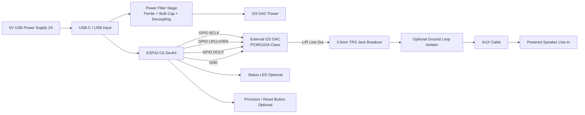
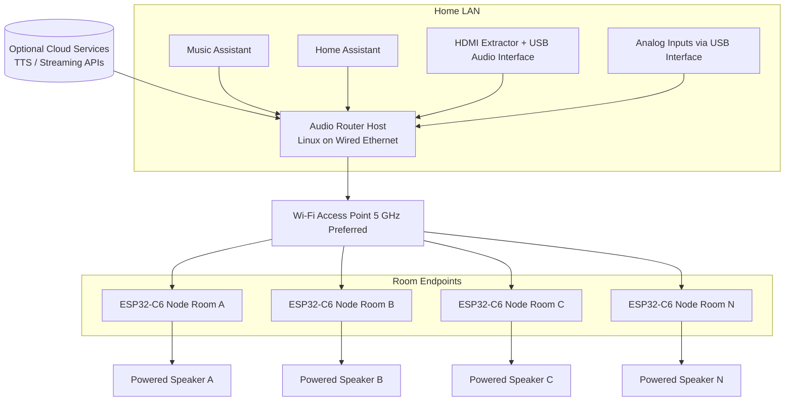
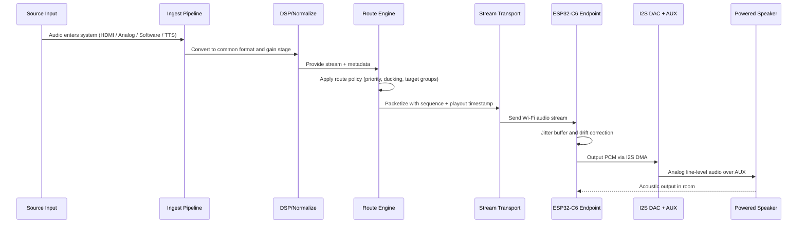
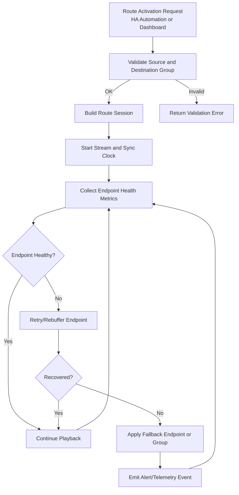
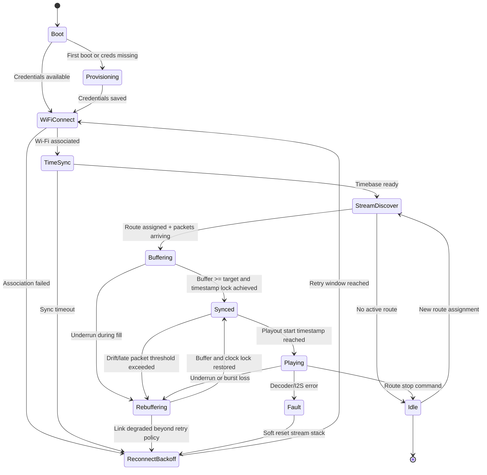
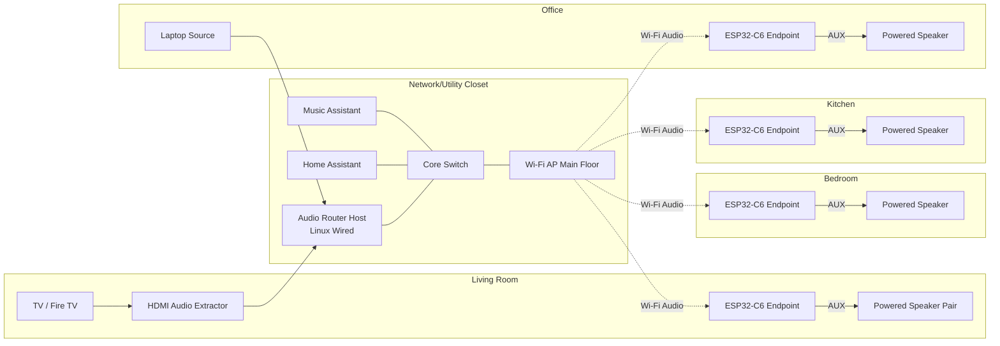

## Architecture: Multi-Source To Multi-Destination Audio Matrix (ESP32-C6 Endpoint Design)

## 1. Executive Summary

This document defines a production-ready architecture for routing audio from many input sources to many destinations, with ESP32-C6 dev boards as the primary room distribution endpoints.

Each endpoint receives audio over Wi-Fi, converts digital audio to line-level analog, and feeds a powered speaker through AUX.

The architecture prioritizes:

1. Reuse of existing hardware and Home Assistant ecosystem.
2. Tight multi-room synchronization where practical.
3. Deterministic routing and operational visibility.
4. A clean migration path to phase 2 microphone inputs.

## 2. Scope And Assumptions

### In Scope (Phase 1)

1. Sources: HDMI audio, analog line-in, software player output (mp3/wav/mpeg4), AI TTS output.
2. Destinations: ESP32-C6 endpoints connected to powered speakers via AUX.
3. Control plane: Home Assistant + Music Assistant integrated with a central routing host.
4. Transport: Wi-Fi audio delivery to ESP32-C6 endpoints.

### Out Of Scope (Phase 1)

1. Direct Bluetooth speaker streaming as a primary destination class.
2. Bidirectional intercom and microphone processing (phase 2).

### System Assumptions

1. One always-on Linux host is available on wired Ethernet.
2. Wi-Fi coverage is good in target rooms.
3. Powered speakers accept line-level AUX input.
4. Existing Home Assistant and Music Assistant are already operational.

## 3. High-Level Architecture

### Core Components

1. Audio Router Host (Linux):
   - Source ingest.
   - DSP/pre-processing.
   - Per-route fanout.
   - Sync clock authority.

2. Control Plane:
   - Home Assistant entities/services/automations.
   - Music Assistant playback and media integration.
   - Optional dashboard UI for source-to-room matrix.

3. Endpoint Plane (ESP32-C6 Nodes):
   - Wi-Fi client audio receiver.
   - Jitter buffer and clock drift correction.
   - I2S audio out to DAC.
   - Analog line-level out to AUX.

4. Network:
   - Wired uplink for router host.
   - Wi-Fi for all ESP32 endpoints.
   - VLAN/QoS optional for stability at higher endpoint counts.

### Logical Data Path

1. Source audio enters host ingest pipeline.
2. Host normalizes sample format and applies optional DSP.
3. Route engine maps one source to one or many endpoint groups.
4. Stream packets are timestamped and sent to ESP32 endpoints.
5. Endpoints buffer, synchronize to target playout time, output analog audio.

## 4. Source Ingest Architecture

### 4.1 HDMI Sources (Fire TV / Firestick / TV Devices)

1. Use HDMI audio extractor with analog or SPDIF output.
2. Feed extractor output into USB audio interface on the host.
3. Ingest as persistent named source, for example `source.hdmi_living_room`.

Rationale: HDMI extraction provides deterministic capture and avoids app-specific casting limitations.

### 4.2 Analog Sources

1. Connect line-level analog sources to multi-input USB interface.
2. Normalize gain and sample rate at ingress.
3. Expose each physical channel as independently routeable virtual source.

### 4.3 Software/DSP/TTS Sources

1. Route local app output into virtual sink/source pair on the host.
2. Register TTS output as high-priority source class with ducking policy.
3. Support simultaneous route targets by duplicating source stream at route layer.

## 5. Transport And Synchronization Model

## 5.1 Stream Format Strategy

Use two endpoint stream profiles:

1. Default profile (recommended for ESP32-C6 scale):
   - 16-bit PCM
   - 32 kHz or 44.1 kHz
   - Mono or stereo based on room requirement

2. Bandwidth-optimized profile (optional):
   - ADPCM or low-complexity codec per endpoint firmware capability
   - Used only after stability validation

Starting with PCM reduces firmware complexity and decoder instability risk on constrained MCUs.

## 5.2 Clocking And Drift Control

1. Host is master timing reference.
2. Packets include sequence number + playout timestamp.
3. Endpoint jitter buffer target (for example 80-150 ms) is tunable per room.
4. Endpoints perform slow drift correction by tiny playout rate adjustments.

Target behavior:

1. Stable no-drop playback under normal Wi-Fi variance.
2. Tight perceived sync across rooms for speech and announcements.
3. Acceptable music sync for whole-home listening with calibrated per-room delay offsets.

## 5.3 Network Considerations

1. Router host must use wired Ethernet.
2. Prefer dedicated 5 GHz SSID for audio endpoints when possible.
3. Disable aggressive Wi-Fi power save on endpoints.
4. If available, prioritize audio packets via WMM/QoS.

## 6. ESP32-C6 Endpoint Hardware Architecture

Each room endpoint is an ESP32-C6 dev board plus an audio daughter path.

### 6.1 Minimum Hardware Bill Of Materials (Per Endpoint)

1. ESP32-C6 DevKit (USB powered).
2. I2S DAC board for line output, for example PCM5102A-class module.
3. 3.5 mm TRS jack breakout or prebuilt line-out board.
4. Shielded AUX cable to powered speaker.
5. Stable USB power supply, minimum 5 V / 2 A recommended.
6. Decoupling capacitors near endpoint load:
   - 100 nF ceramic near DAC power pins.
   - 220-470 uF bulk capacitor on 5 V rail near board/DAC.

### 6.2 Recommended Additions For Audio Quality And Reliability

1. Ground loop isolator on AUX path when hum is present.
2. Ferrite bead on USB power line for RF noise suppression.
3. TVS diode (USB power transient protection) for permanent installs.
4. Optional line driver op-amp stage if output level is too low for specific speakers.
5. Small enclosure with airflow and cable strain relief.

### 6.3 Power Management Guidance

1. Use high-quality USB adapters; avoid shared noisy hubs.
2. Keep USB cable short and low resistance.
3. If brownouts occur during Wi-Fi peaks:
   - Increase local bulk capacitance.
   - Upgrade power adapter current margin.
   - Separate DAC and MCU power filtering.

4. For fixed installations, optional PoE approach:
   - PoE splitter to clean 5 V output.
   - Feed ESP32-C6 + DAC from splitter.

### 6.4 Audio Output Chain

1. ESP32-C6 receives Wi-Fi audio packets.
2. Firmware writes decoded/PCM samples to I2S peripheral.
3. External DAC converts I2S to analog line signal.
4. AUX cable carries line-level analog to powered speaker input.

## 7. ESP32-C6 Endpoint Firmware Architecture

### 7.1 Firmware Modules

1. Network manager (Wi-Fi join/rejoin and health checks).
2. Stream receiver (UDP/TCP/WebSocket, depending on final transport choice).
3. Packet parser and sequence checker.
4. Jitter buffer manager.
5. Clock sync and drift correction module.
6. Audio renderer (I2S DMA output).
7. Local control API (volume, mute, room id, diagnostics).
8. OTA update module.

### 7.2 Endpoint State Machine

1. Boot -> Provisioned -> Connected -> Synced -> Playing.
2. Recovery states:
   - Buffering.
   - Re-syncing.
   - Reconnecting.

### 7.3 Endpoint Configuration Model

Per endpoint, store:

1. Node ID and room/zone assignment.
2. Preferred stream profile.
3. Buffer target and max tolerance.
4. Volume trim and EQ preset (optional).
5. Static delay offset for room alignment.

## 8. Control Plane And Route Model

## 8.1 Route Object

A route is:

`source -> dsp_chain(optional) -> destination_group(1..n) -> policy`

Policy fields:

1. Priority.
2. Ducking behavior.
3. Retry/failover strategy.
4. Startup persistence flag.

## 8.2 Home Assistant Integration

1. Create entities for source selection, destination groups, and route presets.
2. Expose services for:
   - `audio_route.activate`
   - `audio_route.stop`
   - `audio_route.set_group_volume`

3. Trigger routes from automations, scenes, and dashboard controls.

## 8.3 Music Assistant Integration

1. Keep Music Assistant as media source and orchestration component.
2. Inject selected MA streams into host route engine.
3. Allow MA and HA automation to share route presets.

## 9. Reliability, Telemetry, And Operations

### 9.1 Metrics

1. Per-endpoint RSSI and reconnect count.
2. Buffer underruns/overruns.
3. Packet loss and reorder rates.
4. Drift correction magnitude.
5. End-to-end latency estimate.

### 9.2 Operational Controls

1. Health watchdog per endpoint.
2. Automatic endpoint quarantine on repeated faults.
3. Fast fallback to alternate room endpoint when available.
4. One-click route reapply after host restart.

### 9.3 Update Strategy

1. Staged OTA rollout by endpoint cohorts.
2. Canary endpoint per firmware release.
3. Rollback image support.

## 10. Security Model

1. Isolate endpoint network where practical.
2. Use per-device credentials/provisioning secrets.
3. Sign OTA payloads.
4. Restrict control API to trusted LAN segments.
5. Avoid exposing raw endpoint control ports externally.

## 11. Phase 2 Readiness: Microphone Expansion

Design endpoints and route engine now to support uplink audio later:

1. Reserve endpoint firmware hooks for I2S mic capture.
2. Add room-level privacy state and physical mute design option.
3. Extend route model to include uplink sources without changing core abstractions.
4. Add AEC/noise suppression at host for duplex use cases.

Suggested phase 2 hardware add-on per room:

1. I2S MEMS microphone module (for example INMP441-class).
2. Optional hardware mute switch with status GPIO.

## 12. Phased Delivery Plan

### Phase A: Lab Proof (2-3 endpoints)

1. Build 2-3 ESP32-C6 nodes with DAC + AUX.
2. Validate Wi-Fi receive, jitter buffer, and stable audio output.
3. Establish baseline latency and drift measurements.

### Phase B: Core Routing

1. Implement host route model and HA control services.
2. Integrate HDMI and one analog source.
3. Create first operational presets (TV-to-rooms, TTS-to-all).

### Phase C: Scale-Out

1. Expand to full endpoint count.
2. Add monitoring dashboards and automated recovery.
3. Calibrate per-room offsets for sync consistency.

### Phase D: Hardening

1. OTA lifecycle and rollback validation.
2. Power-noise mitigation tune-up by room.
3. Burn-in testing under peak fanout.

## 13. Validation Criteria

1. Any supported source can be routed to any endpoint group without service restart.
2. A single source can fan out to at least 8 endpoints with stable playback.
3. Route activation to audible output remains within agreed SLA.
4. No audible pops/clicks during normal route switching.
5. Endpoint recovery from Wi-Fi interruption is automatic and deterministic.
6. TV audio and TTS scenarios are reproducible as one-click presets.

## 14. Key Risks And Mitigations

1. Risk: Wi-Fi congestion causes drops.
   - Mitigation: dedicated SSID/channel planning, tuned jitter buffers, endpoint QoS.

2. Risk: USB power noise introduces hum/hiss.
   - Mitigation: clean adapters, filtering, isolators, enclosure wiring discipline.

3. Risk: Endpoint CPU saturation on codec complexity.
   - Mitigation: start with PCM profile, add compressed profile only after profiling.

4. Risk: Multi-room sync drift across long sessions.
   - Mitigation: timestamp-based playout, periodic drift correction, per-room offset calibration.

## 15. Recommended Initial Reference Build (Per Room)

1. ESP32-C6 DevKit.
2. PCM5102A I2S DAC module.
3. 3.5 mm line-out breakout.
4. 5 V / 2 A USB adapter with short quality cable.
5. 220-470 uF bulk capacitor near board.
6. Shielded AUX cable.
7. Ground loop isolator (install when needed).

This reference build minimizes complexity and gives a reliable baseline before advanced codec or duplex microphone features are introduced.

## 16. Visualization Diagrams

### 16.1 ESP32-C6 Endpoint Wiring Diagram

### 16.2 Network Topology Diagram

### 16.3 End-To-End Process Flow Diagram

### 16.4 Control And Recovery Flow (Operational)

### 16.5 Pin-Level ESP32-C6 Wiring Table (Reference Mapping)

The exact GPIO numbers can vary by ESP32-C6 devkit variant. Use this as a reference mapping pattern and confirm against your specific board pinout before assembly.

| Function                      | ESP32-C6 Signal                          | Typical DAC Pin                    | Notes                                                   |
| ----------------------------- | ---------------------------------------- | ---------------------------------- | ------------------------------------------------------- |
| I2S Bit Clock                 | `I2S_BCLK` on chosen output-capable GPIO | `BCK` / `BCLK`                     | Keep trace short and away from noisy power rails.       |
| I2S Word Select               | `I2S_WS` on chosen output-capable GPIO   | `LCK` / `LRCK` / `WS`              | Must match firmware I2S slot configuration.             |
| I2S Data Out                  | `I2S_DOUT` on chosen output-capable GPIO | `DIN`                              | ESP32-C6 transmits PCM samples on this line.            |
| Ground                        | `GND`                                    | `GND`                              | Use common ground between devkit, DAC, and jack board.  |
| 5 V Power                     | `5V/VBUS` from USB rail                  | `VIN` / `5V`                       | Feed through filter stage where possible.               |
| 3.3 V Power (if DAC requires) | `3V3`                                    | `3V3`                              | Only if your DAC board supports/needs 3.3 V input.      |
| Left Analog Out               | N/A (DAC analog domain)                  | `LOUT`                             | Route to 3.5 mm TRS tip (or board equivalent).          |
| Right Analog Out              | N/A (DAC analog domain)                  | `ROUT`                             | Route to 3.5 mm TRS ring (or board equivalent).         |
| Analog Ground                 | N/A                                      | `AGND` / `GND`                     | Route to 3.5 mm TRS sleeve.                             |
| Optional Mute Control         | Output-capable GPIO                      | Mute/Enable pin on amp/line driver | Useful for pop suppression during stream state changes. |

Suggested passive components near the endpoint:

1. 100 nF ceramic capacitor close to DAC power pin.
2. 220-470 uF bulk capacitor on local 5 V rail.
3. Ferrite bead on USB power input path.

### 16.6 Endpoint Stream Protocol State Diagram (Sync And Jitter Buffer)

### 16.7 One-Floor Deployment Layout Diagram (Example)

Deployment note:

1. Place ESP32 endpoints near speakers to keep analog cable runs short and reduce noise pickup.
2. Keep the audio router host wired, not Wi-Fi, to preserve timing stability during fanout.
3. Prefer AP placement that gives strong RSSI in every target room before scaling endpoint count.
